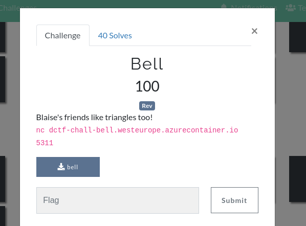

Analyze the binary and view the disassembly of the `main` function:


`process` seems to be doing the bulk of the work:


We can see that the flag getting printed depends on the outputs of the triangle function within the for-loop being the same value as the user input:


Based on the disassembly, we can replicate the function locally with python:
```
import sys
def triangle(arg1, arg2):
    ret = 0
    if arg2 > arg1:
        ret = 0
    else:
        if arg1 == 1 and arg2 == 1:
            ret = 1
        elif arg1 != 1 or (arg1 == 1 and arg2 != 1):
            if arg2 != 1:
                ret = triangle(arg1 - 1, arg2 - 1) + triangle(arg1, arg2 - 1)
            else:
                ret = triangle(arg1 - 1, arg1 - 1)
    return ret

for i in range(1, int(sys.argv[1])+1):
    print(triangle(int(sys.argv[1]), i))
```

Running the binary, we can see that the program outputs a single number and waits for input:
```
kali@kali:/mnt/hgfs/CTF/dctf$ nc dctf-chall-bell.westeurope.azurecontainer.io 5311
11
```

Using our own triangle function, we can calculate what the program needs us to input in order to output the contents of the flag:


Now we can provide the output generated from our program into the bell program, which should give us the flag right away:
```
kali@kali:/mnt/hgfs/CTF/dctf$ nc dctf-chall-bell.westeurope.azurecontainer.io 5311
11
115975
137122
162409
192713
229114
272947
325869
389946
467767
562595
678570
dctf{f1rst_step_t0wards_b3ll_l4bs}
```

Flag: `dctf{f1rst_step_t0wards_b3ll_l4bs}`
