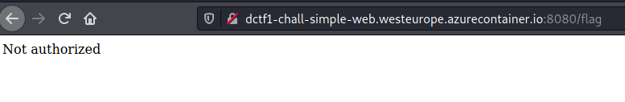
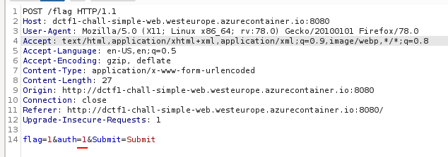
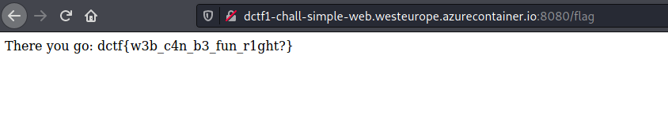

Prompt:
```
Time to warm up!
```

Visiting the website:


Checking the box and clicking submit to request the flag, we get a "Not Authorized" message, as expected:



Intercepting the request with Burp, we can see that we are sending an auth parameter with value 0 whenever we request the flag:

![/flag request](simple-web3.png

Change auth=0 to auth=1 to bypass authentication:



The request goes through now and we are sent the flag:



Flag: `dctf{w3b_c4n_b3_fun_r1ght?}`
