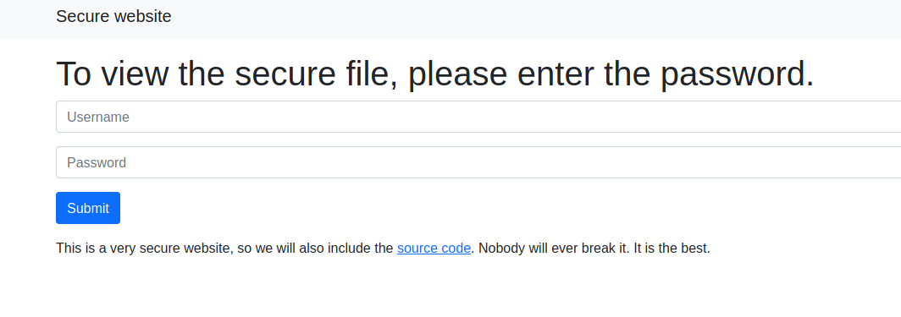
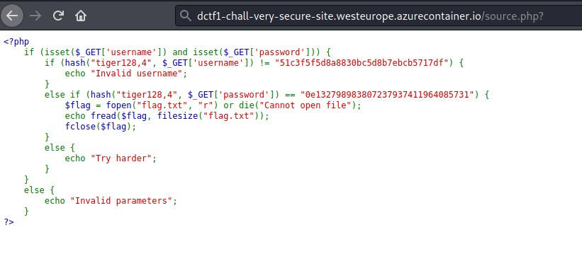
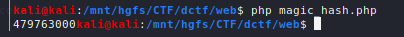
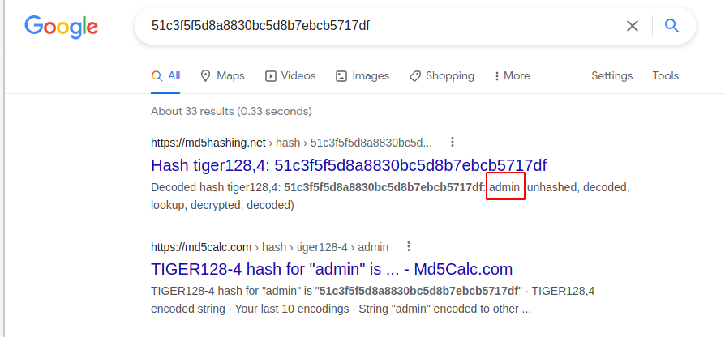
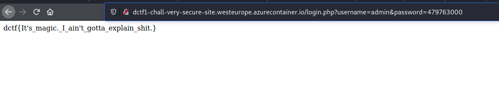

Magic hashes

Visiting the website, we can see a login panel as well as a link to the source code of the login mechanism:





At this point, there is a well-known security vulnerability that arises when doing comparisons between hashes in PHP with the `!=` or `==` operators.
If the hashes being compared start with the `0e`, then PHP will always evaluate it to `0` during the comparison. The ramifications of this is that, as long as we provide a hash starting with `0e` (or similar, depending on the type of hash used), and if the hash on the other side of comparison also starts with `0e`, then PHP will effectively think both of the hashes are the same since they both evalate to `0`.

In this case, since we were given the source code for the login panel, we can easily create a PHP script that will generate a hash that satisfies the hash comparison specified in the source code.

```php
<?php
$i = 0;

do{
        $i++;

} while(hash("tiger128,4", strval($i)) != "0e132798983807237937411964085731");

echo "$i";
?>
```

We run the script and shortly after, it outputs the number `479763000`. Presumably, this means that the 128-bit, 4-pass Tiger hash for `479763000`, evaluated to a hash starting with `0e`. Consequently, this also means that providing that number as input to the login panel will satisfy the comparison that occurs for the password field.



In order to obtain the correct hash for the username field, we can attempt to look for information on the hash online, hoping that the hash is not unique.
We shortly discover that it is actually the hash for the string "admin":



Providing `admin` for the username and `479763000` for the password, we are now able to log in and are presented with the flag upon logging in:



Flag: `dctf{It's_magic._I_ain't_gotta_explain_shit.}`

Additional Resources:
- https://securityaffairs.co/wordpress/36732/hacking/php-hash-comparison-flaw.html
- https://www.whitehatsec.com/blog/magic-hashes/
